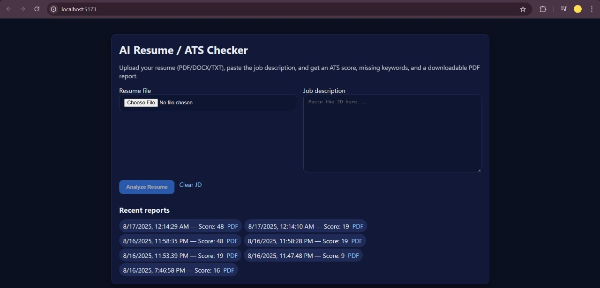
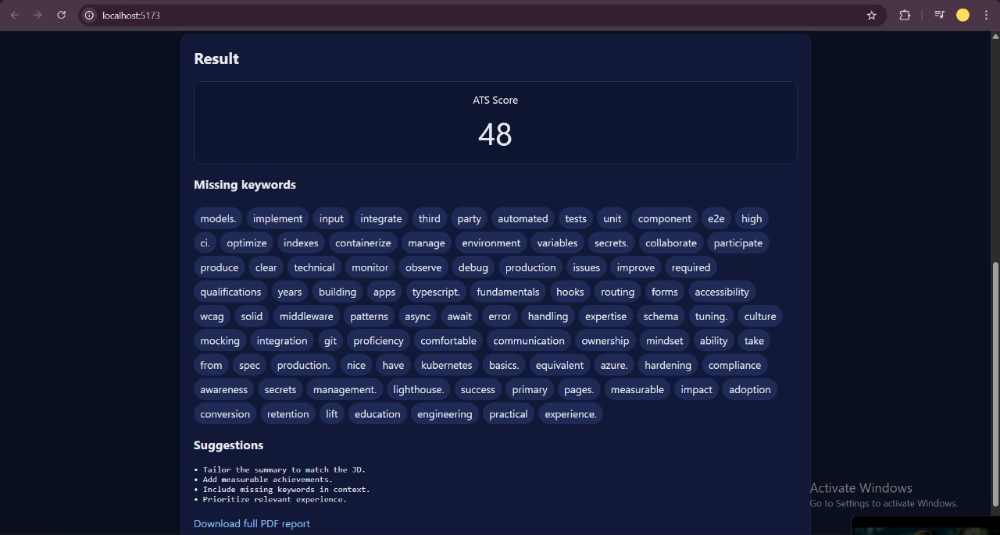
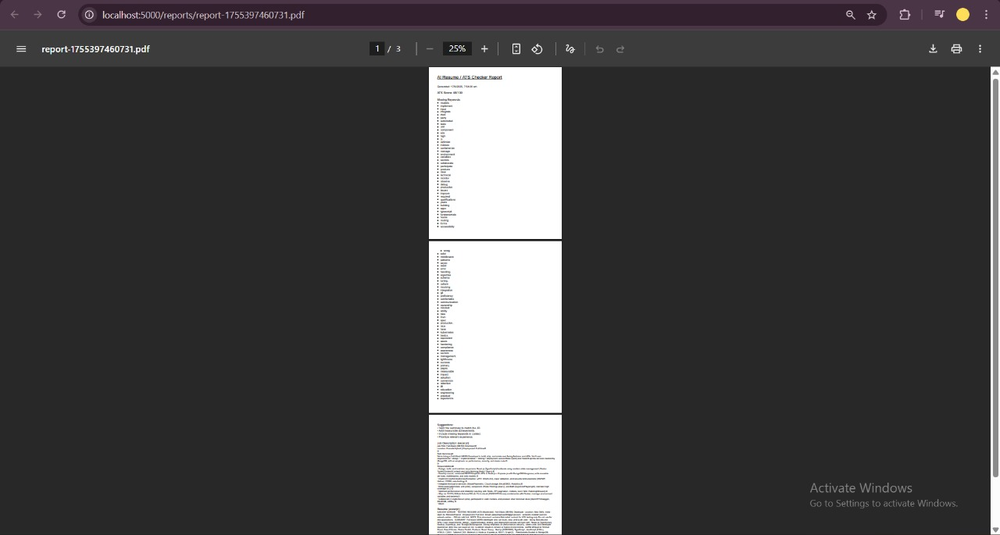

# 📄 AI Resume / ATS Checker (MERN + OpenAI)

[](#license)


Upload a resume (PDF/DOCX/TXT) and paste a job description to get an **ATS score**, **missing keywords**, **AI suggestions**, and a **downloadable PDF report** — built with **MERN + OpenAI**.

**Live Demo:** `<add-frontend-url>`  
**API:** `<add-backend-url>`  

> ⚠️ Privacy note: This tool is for learning/testing. Avoid uploading sensitive data.

---

## Table of Contents
- [Features](#-features)
- [Tech Stack](#-tech-stack)
- [Local Setup](#-local-setup)
- [Environment Variables](#-environment-variables)
- [API](#-api)
- [How Scoring Works](#-how-scoring-works)
- [Screenshots](#-screenshots)
- [Deploy](#-deploy)
- [Troubleshooting](#-troubleshooting)
- [Roadmap](#-roadmap)
- [Contributing](#-contributing)
- [License](#-license)

---

## ✨ Features
- ✅ **ATS Score** — 70% keyword overlap + 30% semantic similarity (OpenAI embeddings)
- 🔑 **Missing Keywords** — terms from the JD not found in the resume
- 🧠 **AI Suggestions** — concise, actionable bullets to improve your resume
- 📄 **PDF Report** — downloadable report with score, keywords, and suggestions
- 🕘 **History** — quick endpoint to fetch recent analyses (when DB connected)

---

## 🧱 Tech Stack
**Frontend:** React (Vite), Axios  
**Backend:** Node.js, Express, Multer (v2), pdfjs-dist (PDF text), Mammoth (DOCX), pdfkit (reports)  
**AI:** OpenAI API (embeddings + chat)  
**DB:** MongoDB + Mongoose

---

## 🚀 Local Setup

### Prerequisites
- Node.js **18+** and npm
- OpenAI API key
- MongoDB (local or MongoDB Atlas)

### 1) Backend
```bash
cd backend
npm install

# copy env (Windows PowerShell: Copy-Item .env.example .env)
cp .env.example .env

# edit .env and add your values (see "Environment Variables" below)
npm run dev   # http://localhost:5000/api/health  ->  { "ok": true }
```

### 2) Frontend
```bash
cd ../frontend
npm install

# optional: point to a custom backend
# Windows PowerShell: echo VITE_API_BASE=http://localhost:5000 | Out-File -Encoding ascii .env
# macOS/Linux:       echo VITE_API_BASE=http://localhost:5000 > .env

npm run dev   # usually http://localhost:5173
```

---

## 🔐 Environment Variables

**backend/.env**
```
OPENAI_API_KEY=sk-<your-key>
MONGO_URI=mongodb://127.0.0.1:27017/atschecker   # or your Atlas URI
PORT=5000
```

**frontend/.env** (optional)
```
VITE_API_BASE=http://localhost:5000
```

> `.env` files are ignored via `.gitignore` — never commit secrets.

---

## 🔌 API

### POST `/api/resume/analyze`
- **Body**: `multipart/form-data`
  - `resume` (file) — `.pdf`, `.docx`, or `.txt`
  - `jobDescription` (string)
- **Response**:
```json
{
  "_id": "6650... (optional if DB connected)",
  "score": 87,
  "missingKeywords": ["oauth", "redis", "react query"],
  "suggestions": "- Tailor your summary...\n- Add measurable results...",
  "reportUrl": "/reports/report-1712345678.pdf"
}
```

**cURL**
```bash
curl -X POST http://localhost:5000/api/resume/analyze   -F "resume=@C:/path/to/resume.pdf"   -F "jobDescription=We need a MERN developer with React, Node, Express, MongoDB..."
```

### GET `/api/resume/history`
- Returns the **last 20** analyses (requires MongoDB connection).

---

## 🧠 How Scoring Works
- **Keyword Coverage (70%)** — tokenized, de-duplicated overlap between JD and resume.
- **Semantic Similarity (30%)** — cosine similarity using `text-embedding-3-small`.
- **Suggestions** — generated via `gpt-4o-mini` at low temperature (0.2).

> No OpenAI key? You still get keyword scoring and a safe fallback for suggestions.

---

## 🖼️ Screenshots

> Screenshots are stored in `docs/` and referenced below.
>
> - `docs/screen-home.png` — Home page (upload + JD)
> - `docs/screen-results.png` — Results (score, keywords, suggestions)
> - `docs/screen-pdf.png` — Generated PDF report





---

## 📦 Deploy

### Backend → Render (recommended)
- New Web Service → connect GitHub repo
- **Root Directory:** `backend`
- **Build Command:** `npm install`
- **Start Command:** `node server.js`
- **Env Vars:** `OPENAI_API_KEY`, `MONGO_URI` (platform sets `PORT`)
- Test: `https://<your-backend>/api/health` → `{ "ok": true }`

**CORS (server.js)**
```js
import cors from "cors";
// allow only your frontends
app.use(cors({ origin: ["http://localhost:5173", "https://<your-frontend-domain>"] }));
```

### Frontend → Vercel/Netlify
- **Root Directory:** `frontend`
- **Env Var:** `VITE_API_BASE=https://<your-backend-domain>`
- Build → Open site → run an analysis end-to-end.

---

## 🛠️ Troubleshooting

- **PDF parse error**  
  Use text-based PDFs or `.docx` (scanned PDFs often contain images only). For OCR, consider Tesseract as a future enhancement.

- **“Failed to analyze”**  
  Check backend logs. Ensure `OPENAI_API_KEY` is set and MongoDB reachable. The app still returns a score without OpenAI (keywords only).

- **CORS blocked**  
  Restrict/allow your frontend origin in `server.js` (see Deploy section).

- **Large files**  
  Multer v2 supports size/type limits. Example:
  ```js
  limits: { fileSize: 2 * 1024 * 1024 },  // 2 MB
  ```

- **Windows paths in cURL**  
  Quote paths containing spaces:
  ```
  -F "resume=@\"C:/Users/You/Documents/resume.pdf\""
  ```

---

## 🗺️ Roadmap
- [ ] Highlight matched JD keywords in resume lines
- [ ] OCR support for scanned PDFs (Tesseract)
- [ ] Auth + per-user analysis history
- [ ] Rate limiting & better UI toasts
- [ ] Export tailored rewrite as `.docx`

---

## 🤝 Contributing
PRs welcome! For major changes, open an issue to discuss first.

---

## 📜 License
This project is licensed under the [MIT License](./LICENSE).
